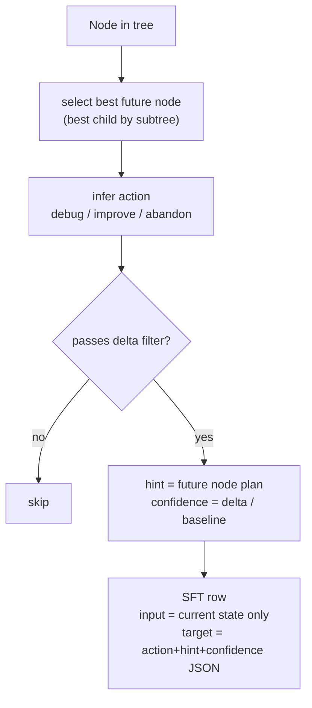
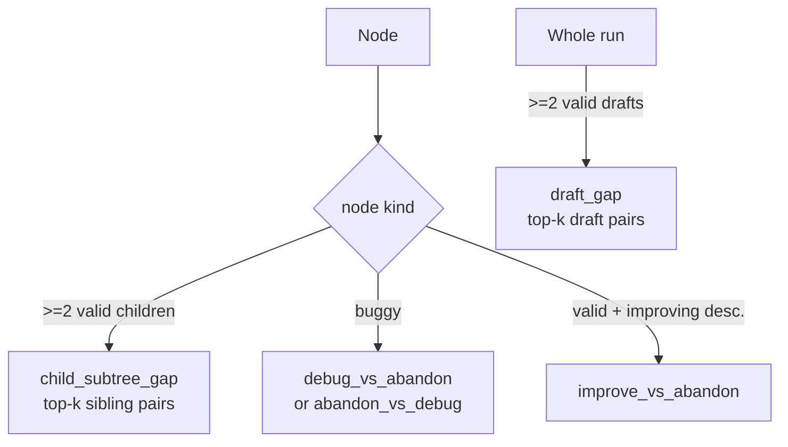

# Hint Controller Datasets

This document explains how the two training datasets for the AIDE hindsight
controller are built:

- **SFT** (`sft.jsonl`) - supervised fine-tuning of the controller.
- **Preferences** (`preferences.jsonl`) - DPO preference pairs.

Both are produced by a single pass over completed AIDE search trees.

- Builder: [`aide/rlhf/hint_exporter.py`](hint_exporter.py)
- CLI: [`scripts/export_hint_controller_data.py`](../../scripts/export_hint_controller_data.py)
- Prompt/target formatting: [`aide/rlhf/hint_prompt.py`](hint_prompt.py)

```bash
python scripts/export_hint_controller_data.py \
  --logs_dir data/heuristic_runs/logs \
  --out data/heuristic_runs/hint_controller/sft.jsonl \
  --preferences_out data/heuristic_runs/hint_controller/preferences.jsonl
```

## 1. Source material: AIDE search trees

Each AIDE run produces a `journal.json` (a [`Journal`](../journal.py)): a tree of
`Node`s where every node holds generated `code`, a `plan`, the execution
`term_out`, an `analysis`, a `metric`, and an `is_buggy` flag. Edges encode how
solutions were derived from one another:

- **draft** - a root node (`parent is None`), an initial solution attempt.
- **debug** - child of a *buggy* parent (fixing an error).
- **improve** - child of a *valid* parent (refining a working solution).

The exporter walks every `journal.json` under `--logs_dir`
(`export_logs_dir` -> `export_journal_file`).

### Per-run setup (`export_journal_file`)

For each journal the exporter resolves four things via
`_resolve_task_and_metrics`:

1. **Task** - looked up in the CTU index (`data/ctu_datasets_info.csv`) by the run
   directory name (`_parse_run_dirname` strips `__seedN`). If the run is **not**
   in the index (e.g. Kaggle-style tasks), a **fallback `CTUTask`** is built from
   the run's own `config.yaml` (`goal`, `eval`) plus journal-derived values.
   This is what lets non-CTU runs contribute instead of being dropped.
2. **`task_desc`** - the `{Task goal, Task evaluation}` text shown to the model.
3. **`maximize`** - read from any valid node's `metric.maximize` (e.g. `True` for
   F1/accuracy, `False` for MAE/RMSE), defaulting to `True`.
4. **`baseline`** - `abs(best valid metric)` (or `1.0`), used only to normalize
   confidence scores and the relative gap threshold.

`compute_subtree_stats` then precomputes, for every node, the best metric found
anywhere in its subtree and in each child's subtree.

### Key helpers

- `_is_valid_node` - not buggy **and** has a numeric metric.
- `_metric_value` - the node's metric (or `None` if invalid).
- `_child_subtree_metric` - best valid metric in a child's whole subtree. This is
  how a child is "scored": a branch is judged by the best result it eventually
  reached, not just the immediate child node.
- `infer_hindsight_action` - the action label implied by hindsight (`debug`,
  `improve`, or `abandon`) given the current node and a chosen future node.
- `build_target_hint` - the hint text. By default it is the **plan** of the better
  future node (`target_source="plan"`, falling back to `analysis`, then an
  `abandon_hint_template`). With `--target_source teacher` an LLM writes the hint
  instead.

## 2. SFT dataset (`sft.jsonl`)

Built by `build_sft_row`, one candidate row **per node**.

For each node:

1. Pick the best **future node** (`select_future_node`, default strategy
   `best_child_by_subtree`): the child whose subtree reached the best metric.
2. Infer the hindsight `action`:
   - buggy node with a viable future -> `debug`
   - valid node with an improving descendant -> `improve`
   - otherwise -> `abandon`
3. Compute the metric `delta` to that future node (sign-corrected by `maximize`).
4. Apply `_passes_delta_filter` (drops non-improving improve/debug rows; abandon
   always passes; buggy->valid always passes).
5. Build the hint (`build_target_hint`) and confidence
   (`_confidence_from_delta`: normalized `delta/baseline`, `0.0` for abandon,
   `0.3` when delta is unknown).

The row's **input** is the deterministic prompt from `format_controller_input`
(task, dataset metadata, current node's depth/status/metric/code/output/analysis,
and a short lineage history - *current state only*, never the future). The
**target** is compact JSON from `format_controller_target`:

```json
{"action":"improve","hint":"...","confidence":0.48}
```

Each row also carries a `messages` array (system + user + assistant) so it can be
trained directly with `--data.input_key messages --data.apply_chat_template`.



## 3. Preferences dataset (`preferences.jsonl`)

DPO needs `(prompt, chosen, rejected)` triples where both responses share the
same prompt but differ in quality. Built by `build_preference_rows` (per node)
plus `build_draft_preference_rows` (per run). There are **four** preference types:

### a) `child_subtree_gap` - which branch was better

For a node with >= 2 children whose subtrees produced valid metrics:

- Score each child by `_child_subtree_metric`.
- `_rank_sibling_pairs` forms all sibling pairs and orders them by metric gap.
- Keep the top `--max_pairs_per_node` (default 3) pairs that pass the gap filter
  (`_passes_preference_gap`: absolute `min_preference_gap` **or** relative
  `gap/|baseline| >= min_preference_gap_frac`) and whose hints differ.
- **chosen** = hint toward the better child's branch; **rejected** = hint toward
  the worse child's branch. Prompt = the shared parent's current state.

This teaches the controller which direction to push when a node could be expanded
multiple ways.

### b) `draft_gap` - which initial approach was better

Drafts are roots, so they are not siblings under any node and are handled at the
**journal level** by `build_draft_preference_rows`:

- Score each draft by its subtree's best metric.
- Rank draft pairs by gap, keep top `--max_pairs_per_node` passing the gap filter.
- The prompt is built from the **worse** draft's state; **chosen**/**rejected**
  contrast the better vs. worse draft direction.

### c) `debug_vs_abandon` / `abandon_vs_debug` - act on a buggy node

For **buggy** nodes (`infer_hindsight_action` branch):

- If a viable fix exists in the subtree: **chosen** = `debug` (hint from the
  successful future), **rejected** = `abandon` (template). Type `debug_vs_abandon`.
- If no fix was ever found: **chosen** = `abandon`, **rejected** = a hypothetical
  `debug` toward the best child. Type `abandon_vs_debug`.

### d) `improve_vs_abandon` - keep refining a valid node

For **valid** nodes that had an improving descendant: **chosen** = `improve`
(hint from the better future node), **rejected** = `abandon` (template).



Every preference row also records the contributing future node ids and metrics
and a `metadata.preference_type`. DPO consumes it with
`--data.prompt_key prompt --data.chosen_key chosen --data.rejected_key rejected`.

### Row format (chat messages)

Because training uses `--data.apply_chat_template`, OpenRLHF's reward/DPO loader
(`reward_dataset.py`) expects `prompt`, `chosen`, and `rejected` to be **lists of
chat messages**, not strings, so that `prompt + chosen` renders a full
conversation. `_chatify_preference_row` wraps the fields at write time:

```json
{
  "prompt":   [{"role": "system", "content": "<HINT_SYSTEM_PROMPT>"},
               {"role": "user", "content": "<current node state>"}],
  "chosen":   [{"role": "assistant", "content": "{\"action\":\"improve\",...}"}],
  "rejected": [{"role": "assistant", "content": "{\"action\":\"abandon\",...}"}]
}
```

(Passing plain strings here triggers `TemplateError: No user query found in
messages`, because the chat template iterates the string's characters and finds
no `user` role.) The `assistant` content is the same compact action/hint/
confidence JSON used as the SFT target.

## 4. Tunable knobs (`ExportConfig` / CLI)

| Flag | Default | Effect |
| --- | --- | --- |
| `--future_strategy` | `best_child_by_subtree` | How the "better future" node is chosen (`best_descendant_k`, `best_leaf`). |
| `--horizon` | `2` | Look-ahead depth for descendant-based action inference. |
| `--target_source` | `plan` | Hint text source: `plan`, `analysis`, or `teacher` (LLM-written). |
| `--teacher_model` | `None` | Model used when `target_source=teacher`. |
| `--min_delta` | `0.0` | Minimum improvement for an SFT improve/debug row. |
| `--min_preference_gap` | `0.01` | Absolute metric gap required for a preference pair. |
| `--min_preference_gap_frac` | `0.005` | Relative gap (`gap/|baseline|`) accepted when the absolute gap is below the floor. |
| `--max_pairs_per_node` | `3` | Cap on sibling/draft pairs emitted per node or per run. |
| `--max_hint_chars` | `600` | Hint truncation length. |
| `--holdout_datasets` | `[]` | Dataset prefixes routed to `sft_val.jsonl` instead of train. |

## 5. Design notes

- **Prompts only ever describe the current node.** Future information is used to
  derive labels/preferences but never leaks into the input, so the trained
  controller can run online from current state alone.
- **Branches are judged by their best eventual outcome** (`_child_subtree_metric`),
  not the immediate child, so a slow-starting branch that pays off is preferred.
- **The gap threshold is metric-relative** so a 0.01 MAE tie and a 0.01 F1 jump
  are not treated the same.
- **Top-k pairing** (instead of best-vs-worst only) and **non-CTU fallback tasks**
  are the two changes that most increase pair yield from a fixed set of trees.
